_`(above image remixed with [PhotoMosh](https://photomosh.com/))`_

> Penguin Cafe (Rockola) and _Babae sa Tag-araw_    
> present the Exhibit Closing Program on 24 May 2006, Wednesday, 9:00 p.m.    
>   
> Performances by  
> Djembe Players and Dancers from Burkina Faso (a must-see)  
> Isha  
> Carol Bello  
> Cynthia Alexander (tentative)  
> Poetry by  
> Libay Linsangan Cantor  
> Yanna Verbo Acosta
> 
> Plus surprise guests/performers and music jam!  
> Open music jam and open mic poetry reading after the program follows.  
>   
> BABAE SA TAG-ARAW photo exhibitors are:  
> [Carolina Rodriguez Bello](https://www.facebook.com/Pinikpikan-8183224682/)  
> [Libay Linsangan Cantor](http://leaflens.blogspot.com/2006/05/)  
> [Aileen Familara](https://www.saatchiart.com/account/artworks/411421)  
> Indira Endaya
> 
> FREE ENTRANCE!

#### **After the Curfew**

**_After the Curfew._** shot in Kathmandu and remixed/rasticulated by Indi Endaya for the _Babae sa Tag-araw_ group exhibit at Penguin Cafe, Remedios circle, Malate, Manila. 25 April-25 May 25, 2006.

**_Bottom label-maker text:_** 'But we need this money to buy Babbage wire for a radio transmitter, sabi ng kasama kong geek sa batang namamalimos nung Tibetan new year. Charles Babbage! Father of the computer! sabi ng batang uhugin. Wow.'  

<figure>

<figcaption>

**Sticky Notes as Prayer Flags!!**

</figcaption>

</figure>

#### **Batang Bhaktapur** (Bhaktapur kid)  

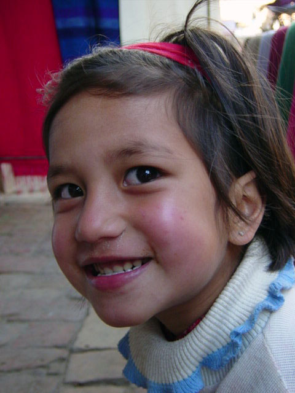

**_Batang Bhaktapur_,** shot in Kathmandu and remixed/rasticulated for the _Babae sa Tag-araw_ group exhibit at Penguin Cafe, Remedios circle, Malate, Manila. 25 April-25 May 25, 2006.

**Bottom label-maker tex**t: _'Her big sister Gihini of the Dalit was a flight attendant. I also want to fly, she said. Like your sister? I said. No. I want to fly the plane so you can touch the clouds in the sky.'_

_**Thanks, Kids and Adam for the exhibit photos.  
Hat tip to to [Brendan G](http://papayapost.blogspot.com/2008/10/brendan-goco-random-cliques.html) for sharing [the best tool to do this.](https://rasterbator.net/)**_  

### Fancy seeing you **here!**

<figure>

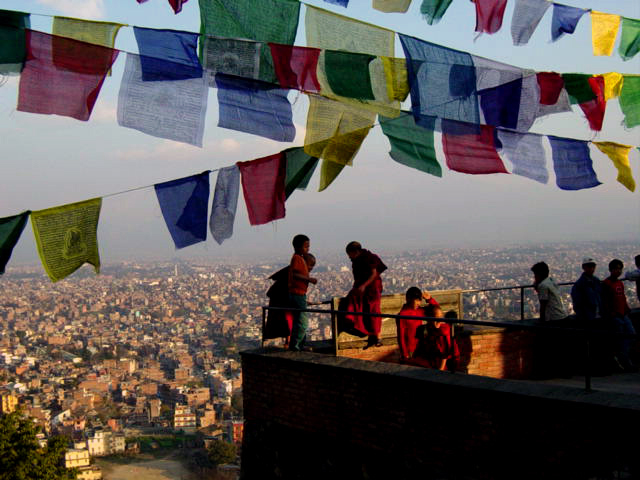

<figcaption>

_photo_ ©  _I Endaya, Kathmandu, 2002._

</figcaption>

</figure>

'We'll always have Paris' is such a cliche; I’ll always have Kathmandu, 2002. I suppose. The Yak and Yeti hotel. My first international conference. For a second, I thought I'd keep these moments for myself.  

<figure>

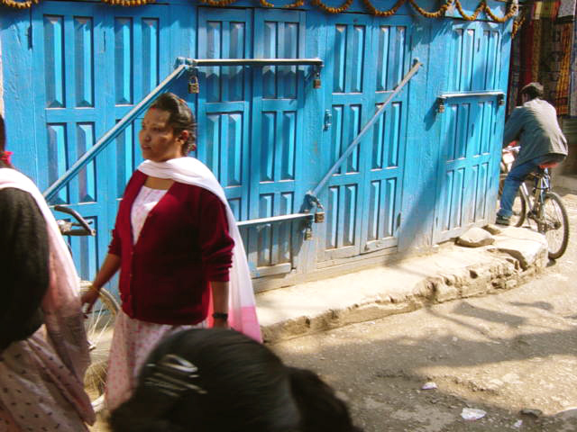

<figcaption>

_photo_ ©  _I Endaya, Kathmandu, 2002._

</figcaption>

</figure>

<figure>

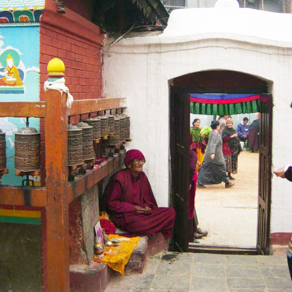

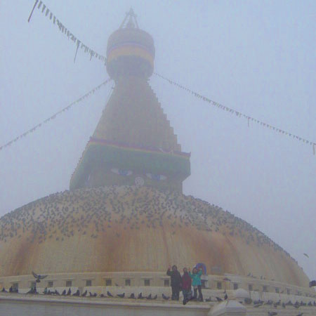

<figure>

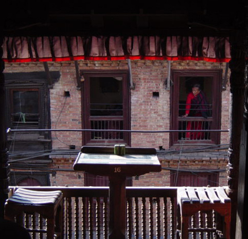

<figcaption>

Dhal bat dinner break

</figcaption>

</figure>

<figure>

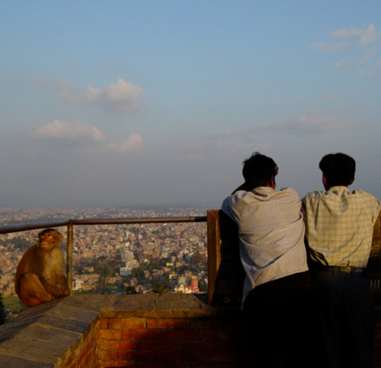

<figcaption>

Spot the cheeky one

</figcaption>

</figure>

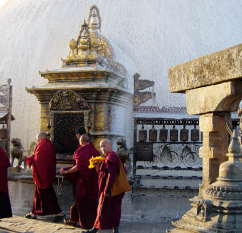

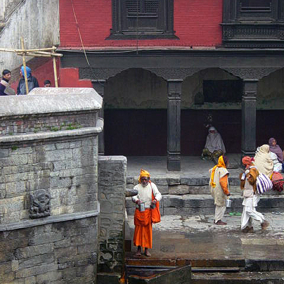

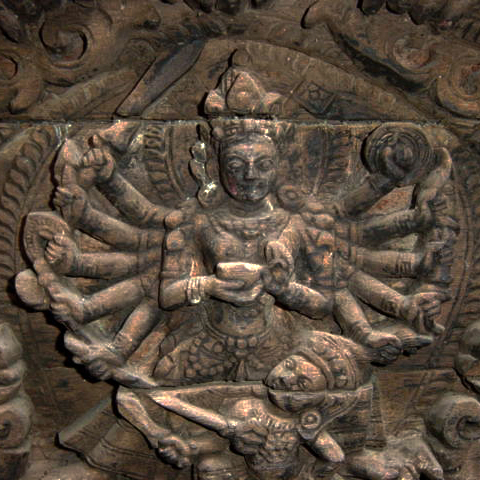

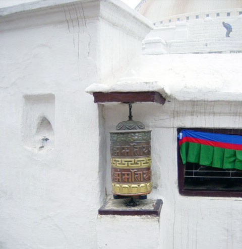

<figure>

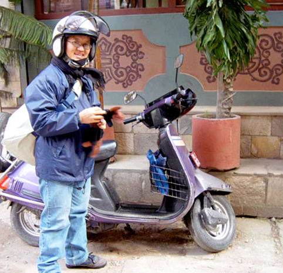

<figcaption>

Lovely G

</figcaption>

</figure>

<figure>

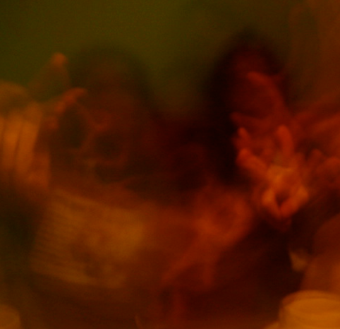

<figcaption>

Just Kids

</figcaption>

</figure>

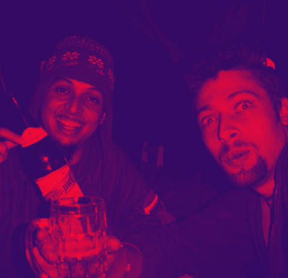

<figure>

<figcaption>

My first digicam. Yak & Yeti hotel

</figcaption>

</figure>

</figure>

_Photos_ © _I Endaya, Kathmandu, 2002._

Stupa-hopping (Boudhanath, Swayambhunath) prayer flags, cheeky monkeys, the Kumari, the ascetics caked in mud. Seduced by souvenir-shop semi precious stones, spinning prayer wheels, pashminas. A dance-y way to nod your head.

<figure>

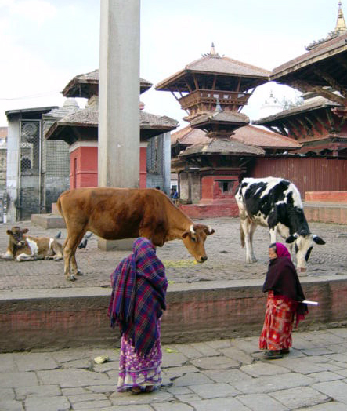

<figcaption>

Holy cow!

</figcaption>

</figure>

Manisha was saying that in these parts you would be the rebel by NOT wearing a nose ring. Bespectacled Ganga at the radio station was explaining a painted depiction of the caste system. (Sherpa is a surname, so I learn. Also, avoid the tourist traps of Thamel!) Anita was talking about her Dalit friend who was trying to escape it all by pursuing a flight attendant career.

Tandoori, dahl bhat, high butter tea. Maoist rebels stopping folks at checkpoints for tarriffs and then issuing official receipts on the way to Anapurna. You had bunked with your dad who was in that Tibetan Buddhist phase back then (or is he, still?). Some kind of shared hostel room. Tropical low-land urban jungle spine-shivers. Wood-burning stoves for just a little bit more warmth by the bed. (Sixteen degrees in the giddy fog. Fair weather, friend!)
