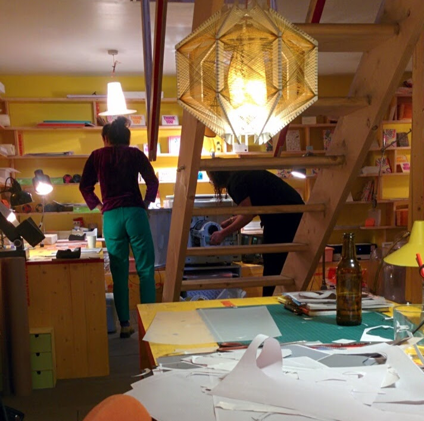
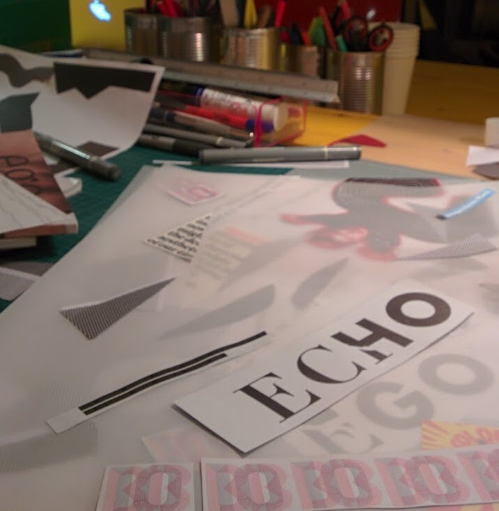
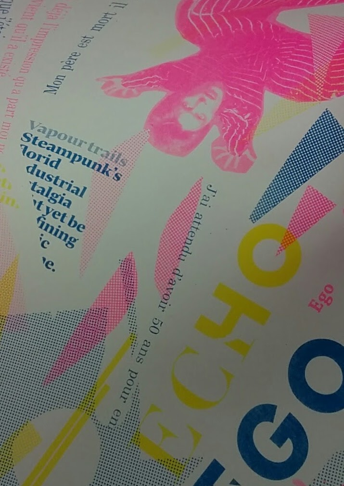

After a few years of checking out all those _Pick me Up_ graphic design festivals at Somerset House, collecting piles of art school degree show print samples, and admiring artwork featured in graphic design exhibits (similar to the _Rise of Riso_, as photographed above, although that came much later) I was left with the impression that [Risograph](https://www.riso.co.uk/risograph.html)y, which I used to write off as a niche retro-artisanal tool (similar to lomo cameras or 8-bit pocket synthesizers) was already 'having its own smashed avocado moment' way before the green stuff caught on with the brunch crowd this side of the prime meridian.

Being rather more curious than trend-averse, not to mention starved for some creative release (not involving any kind of avocado whatsover), I signed up for a Risograph printing class held at the basement of [my favourite new booksho](https://libreria.io/)p in the East End.

<figure>

<figcaption>

_You know that concept book shop in Bricklane beside the vintage clothing place--smartphone ban, yellow wooden shelves, infinity mirrors, titles organised by theme? What's not to love?_

</figcaption>

</figure>

After work, I took the tube to Aldgate East and finally got to see what was at the bottom of the staircase at Libreria.

<figure>

<figcaption>

_'Greige' office unit on the outside, unicorn in the inside._  

</figcaption>

</figure>

Actually, the Risograph machine itself was not really a sight to behold.

It was after all, originally meant to be a digital duplicator: an ink-plus-stencil alternative to the more conventional toner-plus-heat dependent laser printers and photocopiers. But as Jess, our mentor and resident print specialist soon showed us, clichés also apply to copiers: ie, _**it's what's inside that matters**_**.** For indeed, beneath the ‘greige’ office copier exterior, sat these Willy Wonka-esque cylinders of teal, aqua blue, fluoro pink ink: the source of the rich spot colours that make Riso so distinct, so extra. That you can layer these colours on top of each other to produce new ones is a game changer too.

Apparently riso is more about ink, ink, ink, and less about rendering very fine details (a struggle to do with stencils, right.) Ink takes longer to dry on paper and this leads to unpredictable results; bugs turned into features: constructive flaws that lend art editions that handmade, 'no two are alike', silkscreen print look and feel.

<figure>

<figcaption>

_Jess, resident print specialist, behind the ladder, changing the ink._

</figcaption>

</figure>

<figure>

<figcaption>

_Typographic prints by Jess_

</figcaption>

</figure>

As we signed up for a collage-based poster project, piles of old indie magazines were sacrificed so we could stick interesting cutout compositions on tracing paper. Those would then be run through the machine and transformed into a master stencil, one master stencil per layer of colour.  

I had a bit of a relaxed start with ice-cold beer and _Six Music_ playing in the background while the other learner in the room, this young woman who said she worked for a startup, was already making these funky Monstera Deliciosa leaf shapes.

Skimming through the glossy assortment, I soon landed on a page with various shots of David Bowie in the Seventies and excitedly tore off the page that featured him in that shiny stripy Kansai Yamamoto jumpsuit. A proper icon to work around.

<figure>

<figcaption>

_Achievement Unlocked: Playfully experiment with texture, invent new forms, shapes and patterns._

</figcaption>

</figure>

<figure>

<figcaption>

_Bowie + Memphis maybe_

</figcaption>

</figure>

Then things just chirpily fell into place. The collage was done and with much support and expertise from Jess, I was able to come up with my very own A3 print editions. A numbered series of 15. 
  
That was so satisfying. I definitely enjoyed the process. To top that all off, I even got a discount card to use for the bookshop upstairs. Yay!  
  
No time is too soon to do this again. Next time I'll do a zine or maybe some Christmas cards.

<figure>

<figcaption>

_Achievement Unlocked: Getting inky with risograph explorations, rendered and printed on Libreria’s risograph machine. One of fifteen A3 prints in not just two but three colours_  

</figcaption>

</figure>

<figure>

<figcaption>

_Bricklane, Instagrammable AF_

</figcaption>

</figure>

<figure>

<figcaption>

_Bricklane hardsell ;)_

</figcaption>

</figure>

**Interesting links on riso:**

[House of the Risograph  
](http://www.eyemagazine.com/blog/post/house-of-the-risograph)[Hato Press](https://hatopress.net/)  
[Risotto Studio (Scotland)](https://www.risottostudio.com/)  
[Studio Fludd](https://www.studiofludd.com/projects#/gelatology-change-and-persistence/)  
[Duplikat Press](https://www.duplikat.co.uk/work)  
[The Rise of Riso](https://we-make.it/exhibition/exhibition-rise-of-riso/)
