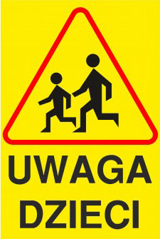

**Logo design project for a series of Children's Community Theatre Workshops in Poland**

**NOTES**:

_**Uwaga dzieci**_**.** Note that the word _**na**_ is added to make the sentence work (originally it's "Attention children" but should be "Attention on children."

"Watch Out for Children" (the words would have to be in Polish "Uwaga **na** Dzieci".

Special Requests:

- to base it on a well-known street sign (the equivalent of "Watch out for Children")
- to have a strong, simple design
- to attract the attention of children so that they will come and take part in the workshops
- to feature children  
    
- have a symbol of theatre within it (e.g. Greek theatre comedy and tragedy masks)

**PROCESS:**

Many elements were developed from the initial image of the street sign

- The triangle  has evolved into a spotlight beaming down on the stage in a dark theatre. It still retains the yellow and dark hazard stripes colour scheme of signs.
- There are two kids representing the concept of a community. I've kept two since adding many human figures would make it too busy to fit in a single logo (which would have to be reduced to fit various small materials such as stationery and business cards etc.)
- The joyful spirit is there and I've done away with actual masks but there is a hint of them with the happy face on the left and the upside down smile on the right.

