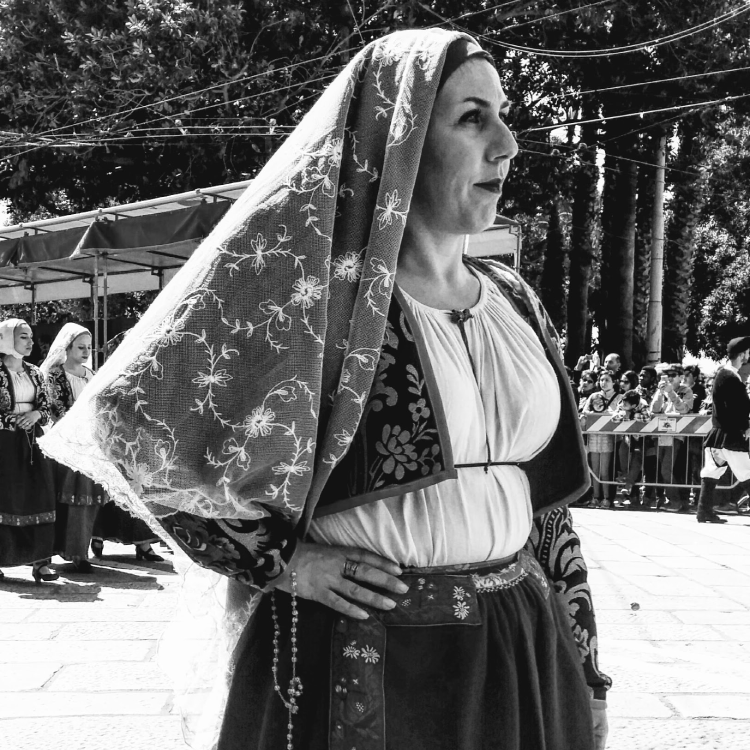

Photo taken at the Festival of St Efisio, Cagliari, Sardinia.

* * *

**Celebrating the 17th Century Plague's End  
**  
If only there was a way to ward it all off. What would you promise to do in exchange for making a terrible chain of events disappear?

The people of 17th-century Sardinia held this procession to honor a certain saint who supposedly wiped out the plague:

> It was in 1652 that Sardinia suffered with the plague and much of the population died. In their desperation, the people turned to Saint Efisio in order to try and free the island from the disease. Efisio - a Roman Commander - had been sent by Emperor Diocletian to suppress Christianity in Sardinia, but upon landing on the island and experiencing what’s described as an epiphany, he converted to Christianity. In 303 AD, Efisio was imprisoned in Cagliari, and shortly after made a martyr by being beheaded by the Romans on the beach of Nora after refusing to deny his new, Christian faith.
> 
> The Sardinian people vowed that if Saint Efisio were to rid them of their terrible plague; they would march in an elaborate procession in his honour each year. 1656 finally saw the end of the plague, and true to their pledge, every year since that day the people of Cagliari have taken to the streets to perform an extravagant parade in an array of traditional clothing to celebrate the Saint.
> 
> \--[Sardinian Places](https://www.sardinianplaces.co.uk/blog/festa-di-santefisio-)

Four Centuries later, here's a photo caption from my mobile phone.

Throwback Thursday. April 2016\*. What's off the frame:  red-pink-white rose petal showers, town piazza by the food stalls: a _casu marzu (maggot cheese)_ monger in medieval shepherd's garb, paper ticket stubs, wooden bleachers, girls in lace (false eyelashes, crimson gloss-lipped), marching bands, hymns to a wooden saint, cattle-drawn carriages festooned with the harvest of the season: (artichokes and leafy greens? I vaguely remember) disappearing into the shadows of The Golden Arches of McDonald's, Cagliari.

Four years forward, celebrating the end of the plague is a dream.
