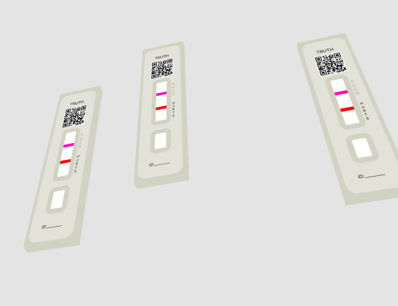

Here's a pandemic project I put together after following the first part of the [Coding Train webGL track](https://thecodingtrain.com/tracks/lang/all/topic/webgl). The video I followed is on [youtube.](https://youtu.be/6TPVoB4uQCU?si=oZqTbH2Ft3dKO6Zn) The code is on my [p5js sandbox](https://editor.p5js.org/codeswitchstudio/sketches/0I1vqYj4d). Also [mentioned in the substack](https://indicodes.substack.com/publish/post/61642598).

<figure>

<figcaption>

Textures made using Figma

</figcaption>

</figure>

<figure>

<figcaption>

Here is the version with the camera following the movement of the user's mouse

</figcaption>

</figure>
